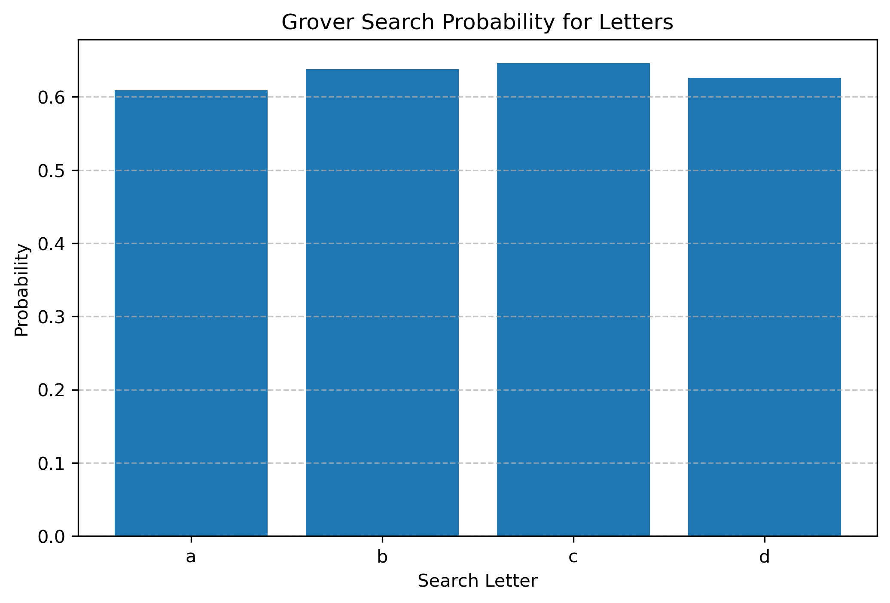

## Grover's Algorithm Simulation

# Grover’s Algorithm for Letter Search Problem
We use Grover’s algorithm to find occurrences of specific letters ('a', 'b', 'c', 'd') in a randomly generated string.

## Problem Statement

Given a random string, we use Grover's algorithm to amplify probability of finding positions of specific letters.

### Description
Grover's algorithm is a quantum search algorithm that provides quadratic speedup over classical search algorithms. 
The circuit consists of an oracle and Grover diffusion operator to amplify the probability of the correct solution state.

### Implementation
- Framework: Qiskit
- Algorithm: Grover Search Algorithm
- Simulation: Qiskit Aer Simulator

## Approach
- Generate random string
- Mark target letter positions using oracle
- Apply Grover operator
- Measure results
- Estimate probability

## Oracle Construction
The oracle marks indices where the target letter appears using X gates and multi-controlled Z gate (MCMT).

## Grover Operator

We construct Grover operator using Qiskit and apply optimal iterations

### Results

The following plot shows the measurement results obtained from the Grover circuit simulation.

