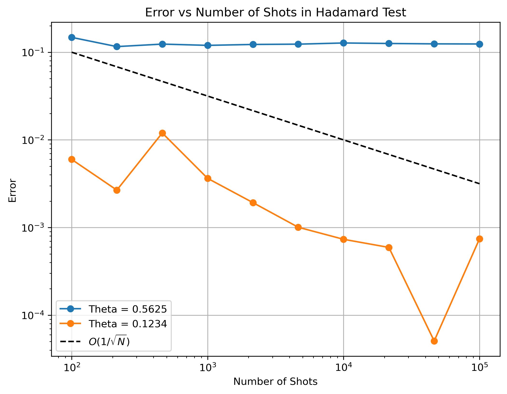

# Hadamard Test

This folder contains the implementation of the Hadamard Test using Qiskit.

## Objective

The Hadamard Test is a quantum algorithm used to estimate the expectation value of a unitary operator. In this implementation, a controlled phase gate is used and the estimation error is analyzed as a function of the number of measurement shots.

## Files

* `Hadamard_good.ipynb` : Jupyter notebook containing the implementation and simulation.
* `hadamard_test_error_vs_shots.png` : Error analysis plot showing the scaling of estimation error with the number of shots.

## Tools Used

* Python
* Qiskit
* Qiskit Aer Simulator
* NumPy
* Matplotlib

## Result

The Hadamard Test was performed for two phase values:

- θ = 0.5625
- θ = 0.1234

For θ = 0.1234, the estimation error decreases with increasing number of shots and reaches values on the order of 10⁻³ to 10⁻⁴ for large shot counts.

For θ = 0.5625, the estimated value converges to approximately 0.438, resulting in a nearly constant error of about 0.124. This behavior indicates an ambiguity in the phase estimation obtained from the cosine-based Hadamard Test measurement.

The error scaling plot demonstrates the statistical behavior of the Hadamard Test and its dependence on the number of measurement shots.

The error decreases approximately as O(1/√N), consistent with the expected statistical behavior of quantum measurements.
