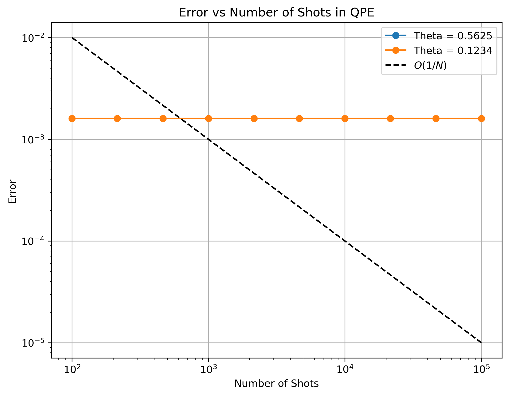
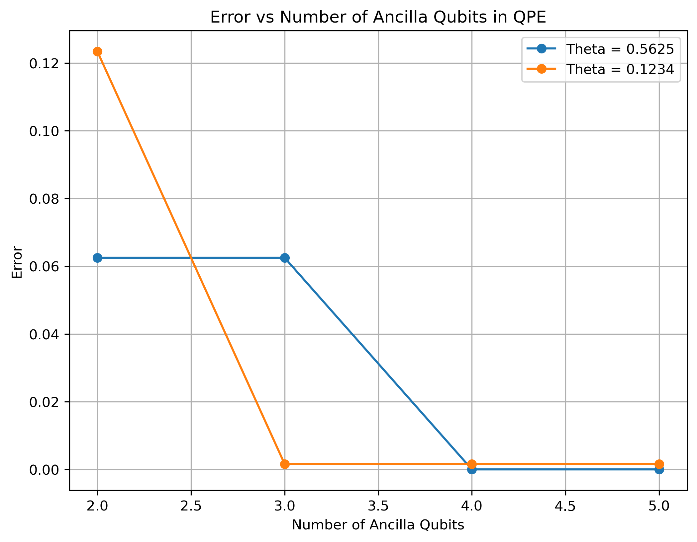

# Kitaev Phase Estimation

This folder contains the implementation of Kitaev's Phase Estimation Algorithm using Qiskit.

## Objective

The goal is to estimate the phase θ of a Phase Gate using Kitaev's phase estimation approach.

Unlike Quantum Phase Estimation (QPE), Kitaev's algorithm estimates the phase bit-by-bit using a sequence of quantum circuits and classical post-processing. The algorithm requires fewer qubits and provides an estimation error that scales approximately as O(1/N), where N is the number of measurement shots.

## Files

* `Kitaev_Trial.ipynb` : Jupyter notebook containing the implementation and simulation.
* `qpe_error_vs_shots.png` : Error versus number of shots (log-log scale).
* `qpe_error_vs_ancilla.png` : Error versus number of ancilla qubits.

## Tools Used

* Python
* Qiskit
* Qiskit Aer Simulator
* NumPy
* Matplotlib

## Results

### Error vs Number of Shots

For a fixed ancilla register size (4 qubits), increasing the number of measurement shots does not significantly reduce the phase estimation error. The dominant source of error is the finite precision of the ancilla register rather than statistical sampling noise. Consequently, the error remains approximately constant as the number of shots increases.

The estimation error was analyzed for different numbers of measurement shots. The log-log plot shows the convergence behavior and can be compared with the theoretical scaling:

O(1/N)

where N is the number of shots.

### Error vs Ancilla Qubits

The phase estimation error decreases as the number of ancilla qubits increases.

For θ = 0.5625, the error becomes essentially zero when four ancilla qubits are used because the phase has an exact 4-bit binary representation (0.1001₂).

For θ = 0.1234, the error decreases significantly but remains finite because the phase cannot be represented exactly using a finite number of binary digits.

These results demonstrate that the accuracy of Quantum Phase Estimation is primarily determined by the number of ancilla qubits, which control the phase resolution of the algorithm.

## References

- Qiskit Documentation
- M. A. Nielsen and I. L. Chuang,
  *Quantum Computation and Quantum Information*
- Course Notes: Scientific Computing with Quantum Algorithms (DS 394),
  Prof. Phani Motamarri, CDS Department, Indian Institute of Science (IISc), Bangalore
