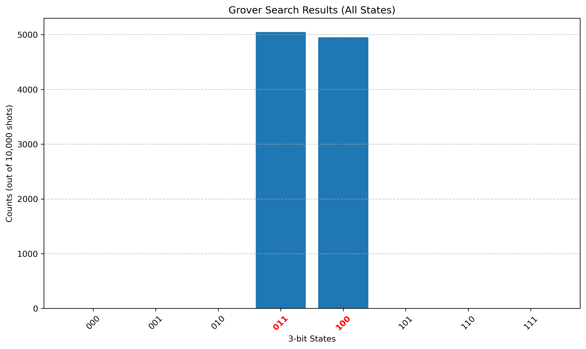

# quantum-algorithms-qiskit
Qiskit-based implementations of quantum computing algorithms for academic assignments.

# Qiskit Quantum Algorithms Assignments

## Implemented Algorithms:
- Quantum Phase Estimation (QPE)
- Grover’s Algorithm

## Structure:
Each question is implemented in a separate Jupyter notebook.

## Question: Quantum Phase Estimation (QPE)

### Implementation
This solution implements QPE using:
- Controlled phase rotations
- Inverse Quantum Fourier Transform
- Aer simulator

### Tools
- Qiskit
- Python

### Output
Measurement histogram shows the estimated phase distribution.

# Grover’s Algorithm for Letter Search Problem
We use Grover’s algorithm to find occurrences of specific letters ('a', 'b', 'c', 'd') in a randomly generated string.

## Problem Statement

Given a random string, we use Grover's algorithm to amplify probability of finding positions of specific letters.

## Approach
- Generate random string
- Mark target letter positions using oracle
- Apply Grover operator
- Measure results
- Estimate probability

## Oracle Construction
The oracle marks indices where the target letter appears using X gates and multi-controlled Z gate (MCMT).

## Grover Operator

We construct Grover operator using Qiskit and apply optimal iterations based on:

## Results

We estimate probability of occurrence of letters using repeated Grover simulations.

# Grover's Search Algorithm for Multiple Marked States

## Problem Statement

Implement Grover's search algorithm using Qiskit to identify multiple marked states in a 3-qubit search space.

The oracle should mark the states:

- |011⟩
- |100⟩

Construct the Grover operator, determine the optimal number of Grover iterations, execute the algorithm on a simulator, and analyze the measurement distribution.

## Results

The Grover search algorithm successfully amplified the amplitudes of the marked states.

Measurement counts obtained from 10,000 shots:

| State | Counts |
|--------|--------|
| 011 | 5048 |
| 100 | 4952 |

All other states were measured with negligible probability.

The results confirm that the marked states |011⟩ and |100⟩ were correctly identified by the Grover search algorithm.
